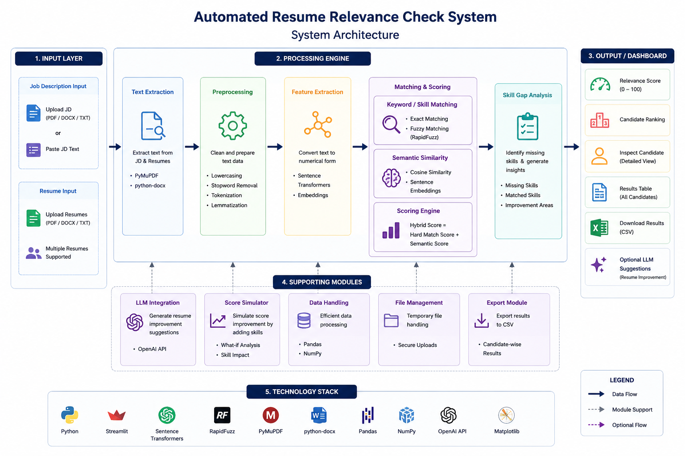
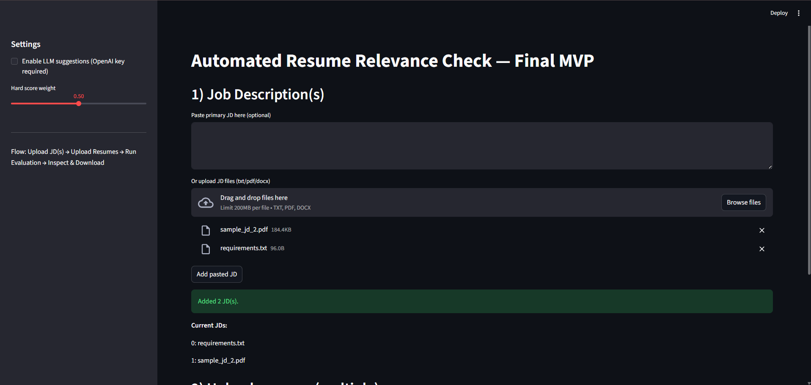
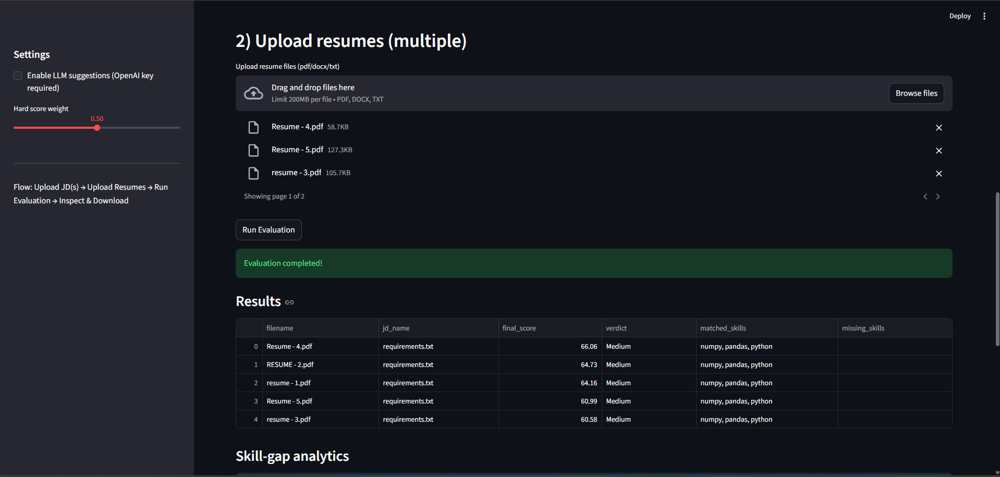
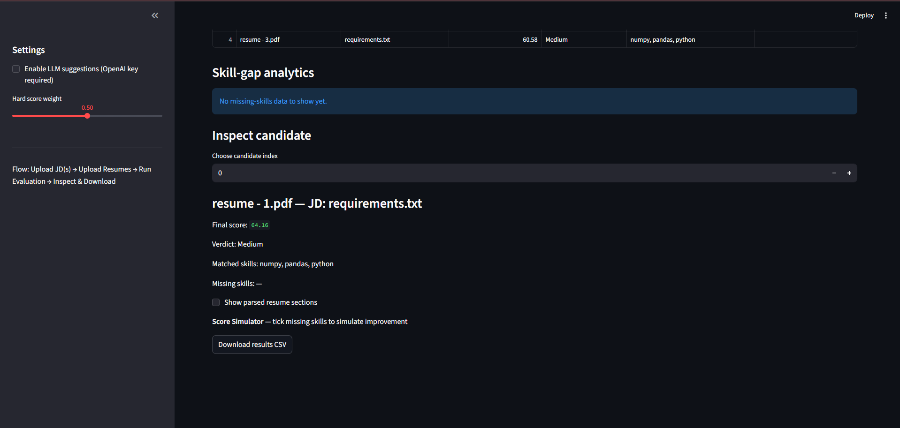
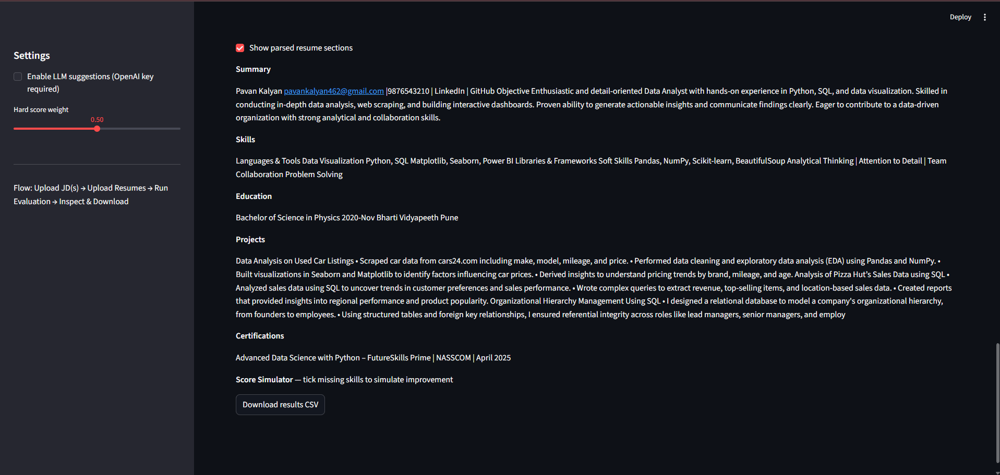

# 🚀 Automated Resume Relevance Check System

An AI-powered Resume Screening and Candidate Evaluation Platform that automatically compares resumes against job descriptions using keyword matching, semantic similarity, and skill-gap analysis.

Designed to streamline the candidate shortlisting process and provide recruiters with quick, data-driven hiring insights.

---

# 📌 Overview

Recruiters often spend significant time manually reviewing resumes against job requirements. This process becomes difficult to scale when hundreds of applications are received for a single role.

This project automates resume evaluation by:

* Parsing resumes and job descriptions
* Matching candidate skills with job requirements
* Calculating resume relevance scores
* Detecting missing skills
* Ranking candidates based on suitability
* Generating actionable feedback

The platform combines traditional skill matching techniques with NLP-based semantic similarity analysis to provide more accurate evaluations.

---

# ✨ Key Features

### Resume Processing

* Upload multiple resumes (PDF, DOCX, TXT)
* Automated text extraction
* Resume section identification

### Job Description Analysis

* Upload or paste Job Descriptions
* Extract required skills and keywords
* Compare multiple candidates against a JD

### Candidate Evaluation

* Keyword Matching
* Fuzzy Skill Matching
* Semantic Similarity Analysis
* Resume Relevance Score (0–100)
* Candidate Ranking

### Skill Gap Analysis

* Missing Skill Detection
* Resume Improvement Suggestions
* What-if Score Simulation

### Dashboard & Reporting

* Interactive Streamlit Dashboard
* Candidate Inspection View
* CSV Export Functionality

### AI Integration

* Optional LLM-Based Feedback
* Resume Enhancement Recommendations

---

# 🏗️ System Architecture



---

# 🔄 Project Workflow

```text
Job Description Upload
          │
          ▼
Resume Upload
          │
          ▼
Text Extraction
          │
          ▼
Preprocessing
          │
          ▼
Keyword Matching
          │
          ▼
Semantic Similarity Analysis
          │
          ▼
Relevance Scoring
          │
          ▼
Skill Gap Detection
          │
          ▼
Candidate Ranking
          │
          ▼
Dashboard & Export
```

---

# 📸 Application Screenshots

## 1. Upload Job Description



The recruiter can upload or paste a Job Description that serves as the evaluation benchmark.

---

## 2. Upload Resumes



Supports multiple resume uploads in PDF, DOCX, and TXT formats.

---

## 3. Candidate Evaluation



Displays relevance score, matched skills, missing skills, and candidate suitability.

---

## 4. Resume Section Analysis



Allows recruiters to inspect extracted resume sections for deeper analysis.

---

# 🧠 Scoring Methodology

The final score is generated using a hybrid evaluation strategy.

### Hard Match Score

Evaluates:

* Skill Matching
* Keyword Matching
* Fuzzy Matching (RapidFuzz)

### Semantic Match Score

Evaluates:

* Contextual Similarity
* Sentence Embeddings
* Cosine Similarity

### Final Score Formula

```text
Final Score =
(Hard Match Weight × Hard Score)
+
(Semantic Weight × Semantic Score)
```

This approach combines exact keyword matching with contextual understanding.

---

# 🛠️ Technology Stack

| Category          | Technology            |
| ----------------- | --------------------- |
| Frontend          | Streamlit             |
| Backend           | Python                |
| NLP               | Sentence Transformers |
| Similarity Search | Cosine Similarity     |
| Resume Parsing    | PyMuPDF, python-docx  |
| Skill Matching    | RapidFuzz             |
| Data Processing   | Pandas, NumPy         |
| Visualization     | Matplotlib            |
| AI Integration    | OpenAI API            |
| Version Control   | Git & GitHub          |

---

# 📂 Project Structure

```text
Automated-Resume-Relevance-Check-System
│
├── app.py
├── requirements.txt
├── README.md
│
├── assets
│   ├── upload_JD.png
│   ├── upload_resume.png
│   ├── inspect_candidate.png
│   ├── show_resume_sections.png
│   └── system_architecture.png
│
├── utils
│   ├── __init__.py
│   ├── embeddings.py
│   ├── extract_text.py
│   ├── preprocess.py
│   ├── scorer.py
│   └── llm_utils.py
│
└── temp
```

---

# 🚀 Installation

Clone the repository:

```bash
git clone https://github.com/SatishSwami/Automated-Resume-Relevance-Check-System.git
```

Navigate into the project directory:

```bash
cd Automated-Resume-Relevance-Check-System
```

Install dependencies:

```bash
pip install -r requirements.txt
```

Run the application:

```bash
streamlit run app.py
```

---

# 💡 Usage

### Step 1

Upload or paste a Job Description.

### Step 2

Upload one or more resumes.

### Step 3

Click **Run Evaluation**.

### Step 4

Review:

* Relevance Score
* Candidate Ranking
* Matched Skills
* Missing Skills
* Resume Insights

### Step 5

Export results as CSV.

---

# 🎯 Future Enhancements

* ATS Compatibility Score
* Recruiter Login System
* PostgreSQL Integration
* FAISS Vector Database
* LangChain Workflows
* Advanced LLM Resume Coaching
* Resume Recommendation Engine
* Multi-Role Evaluation Support

---

# 📈 Project Highlights

* Multi-Resume Evaluation
* Semantic NLP-Based Matching
* Skill Gap Analysis
* Candidate Ranking Dashboard
* Recruiter-Friendly Interface
* Scalable Screening Workflow

---

# 🔗 Links

### GitHub Repository

https://github.com/SatishSwami/Automated-Resume-Relevance-Check-System

### Live Demo

https://automated-resume-relevance-check-system-4srqvoh7wkhxiybvfnkcgk.streamlit.app/
---

# 👨‍💻 Author

**Satish Swami**

B.Tech – Electronics & Telecommunication Engineering

MIT Academy of Engineering (MITAOE), Pune

Areas of Interest:

* Artificial Intelligence
* Machine Learning
* Generative AI
* Data Analytics
* Embedded Systems

---

⭐ If you found this project useful, consider giving it a star.
